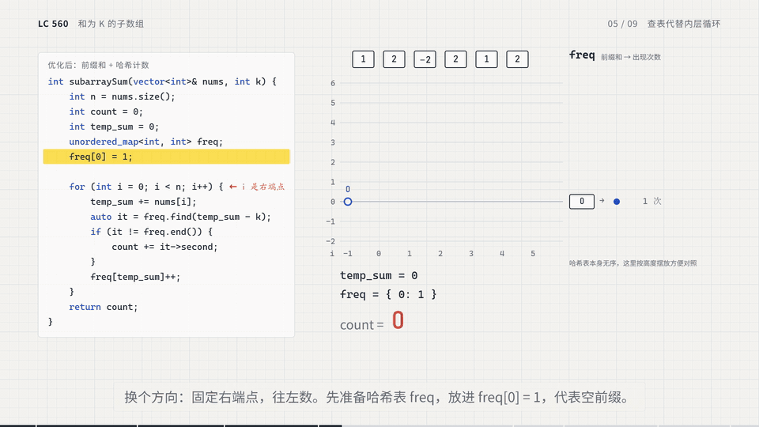

# C++14 刷题笔记

这份笔记随刷题补充，按知识点归纳。同一个容器在新题里出现时，补充新的用法和题目链接，不重复抄一份。

每条记录保留：使用场景、来源题目、关键写法、易错点、复杂度。只把能解释清楚的内容标为已掌握。

代码优化约定：保留自己写出的原始解法，可以完整注释后放在优化版上方；新增优化版并说明思路如何变化，方便对比。不要直接覆盖原解法。

学习进度（2026-09-29）：Day01 / 01_hash 的 LC217、LC1、LC49、LC128、LC560 已全部完成。题目完成依据学习者确认；下面的知识点自查项仍由自己复习后勾选。

## 哈希专题复习索引

| 题目 | 哈希表保存什么 | 关键动作 | 笔记 |
| --- | --- | --- | --- |
| [LC217](Day01_hash_array_matrix/01_hash/lc_217.cpp) | 已出现的数字 | 查询存在，再插入 | [集合基础](#hash-set) |
| [LC1](Day01_hash_array_matrix/01_hash/lc_1.cpp) | 数字 → 下标 | 查补数，再记录当前下标 | [映射基础](#hash-map) |
| [LC49](Day01_hash_array_matrix/01_hash/lc_49.cpp) | 排序字符串 → 原字符串组 / 组下标 | 统一分组键，再追加原字符串 | [分组映射](#anagram-groups) |
| [LC128](Day01_hash_array_matrix/01_hash/lc_128.cpp) | 去重后的数字 | 没有前驱才向右扩展 | [序列起点](#sequence-start) |
| [LC560](Day01_hash_array_matrix/01_hash/lc_560.cpp) | 旧前缀和 → 出现次数 | 查 `temp_sum - k`，再记录当前前缀 | [前缀和计数](#prefix-hash) |

接下来学习 [Day01 / 数组技巧](Day01_hash_array_matrix/02_array/README.md)。

<a id="hash-set"></a>

## 1. unordered_set：记录“某个值是否出现过”

首次记录：2026-09-28。

来源：[LC217 存在重复元素](Day01_hash_array_matrix/01_hash/lc_217.cpp)。

### 为什么这道题用它

题目只需要知道一个数字有没有出现过，不需要记录它出现的次数。

`unordered_set` 是基于哈希的集合，保存不重复的元素，不保证遍历顺序。这里用 `seen` 保存已经遍历过的数字。

如果需要记录“数字 → 出现次数”，再考虑 `unordered_map<int, int>`。

### 本题已经用到的写法

```cpp
#include <unordered_set>
using namespace std;

unordered_set<int> seen;  // 创建存放 int 的集合

seen.count(x);           // x 存在返回 1，不存在返回 0
seen.insert(x);          // 插入 x；已有 x 时不会再保存一份
```

注意：`count(x)` 统计的是集合内有几个等于 x 的元素，普通 `unordered_set` 只可能返回 0 或 1。它不能统计原数组中 x 出现了几次。

本题关键循环：

```cpp
for (int x : nums) {
    if (seen.count(x)) {  // 返回 1 会作为 true，返回 0 会作为 false
        return true;
    }
    seen.insert(x);
}
return false;
```

循环开始处理 x 时，`seen` 中只保存 x 前面的数字。因此，如果 x 已经在集合中，就说明它至少出现了第二次。

### 用一个例子理解顺序

对 `nums = {1, 2, 3, 1}`：

| 当前数字 | 查询前的集合内容（顺序仅用于展示） | count 的结果 | 下一步 |
| --- | --- | --- | --- |
| 1 | 空 | 0 | 插入 1 |
| 2 | 1 | 0 | 插入 2 |
| 3 | 1、2 | 0 | 插入 3 |
| 1 | 1、2、3 | 1 | 返回 true |

如果遍历结束也没有发现重复，返回 false。例如 `{1, 2, 3}`。

### 易错点

- 这份写法必须先查询，再插入。先插入再调用 `count(x)`，每个 x 都会被误判为重复。
- 集合自动去重；重复插入不会增加 `size()`。
- 不保证遍历顺序，不能靠它得到排序结果。
- `unordered_set` 没有 `operator[]`，不能写 `seen[x]`。
- 当前使用 C++14，不能用 C++20 才提供的 `contains(x)`；用 `count` 或 `find` 判断存在。

### 复杂度与哈希原理

`count`、`find`、`insert` 通常平均为 O(1)。哈希先定位到一个桶，再在桶内找元素，原理示例见 [hash_table.cpp](demo/hash_table.cpp)。

本题平均时间复杂度 O(n)，额外空间 O(n)。大量哈希冲突时，单次查找可能退化到 O(n)，本题最坏时间复杂度可到 O(n²)。

### 后续用到时再补：其他常用接口

| 写法 | 含义 |
| --- | --- |
| `seen.find(x) != seen.end()` | 找到 x 时返回指向它的迭代器；找不到时返回 `end()` |
| `seen.erase(x)` | 删除 x，返回删除数量：0 或 1 |
| `seen.size()` | 当前不同元素的数量 |
| `seen.empty()` | 集合是否为空 |
| `seen.clear()` | 清空集合 |
| `seen.insert(x).second` | 本次成功插入返回 true；x 已存在返回 false |

最后一项可把本题的查询和插入合在一起：

```cpp
if (!seen.insert(x).second) {
    return true;  // 插入失败，因为 x 已存在
}
```

先理解原来的 `count` + `insert` 写法，再理解这个返回值。

### 自查

- [ ] 能解释为什么本题用 set，不需要 map。
- [ ] 能解释 `count` 为什么只能返回 0 或 1。
- [ ] 能解释为什么先查再插。
- [ ] 能说明平均 O(1) 的查找为什么仍有最坏 O(n) 的情况。

<a id="hash-map"></a>

## 2. unordered_map：记录“键 → 值”的对应关系

首次记录：2026-09-29。

来源：[LC1 两数之和](Day01_hash_array_matrix/01_hash/lc_1.cpp)。以下示例均使用 C++14。

### 为什么这道题用它

本题不仅要知道补数是否出现过，还要取出它的下标。因此用 `unordered_map<int, int>` 保存“数字 → 下标”。

```cpp
#include <unordered_map>
using namespace std;

unordered_map<int, int> hash_table;  // 第一个 int 是键，第二个 int 是值
hash_table[7] = 1;                  // 数字 7 对应下标 1，并非数组的第 7 个位置
```

键唯一，值可以重复；重复写同一个键会更新它对应的值，不会新增一条记录。容器基于哈希，不保证遍历顺序。如果只需要判断是否出现，选 `unordered_set`；需要附带下标、次数或一组数据时，选 `unordered_map`。

### 本题已经用到的 API：find、end、[]

```cpp
auto it = hash_table.find(temp);      // 按键查找补数 temp
if (it != hash_table.end()) {         // 找到了才可以访问 it 指向的记录
    return {it->second, i};           // 已有数字的下标、当前数字的下标
}
hash_table[cur_num] = i;              // 不存在就插入，存在就更新下标
```

- `find(key)` 返回迭代器，不直接返回值或 true/false；`auto` 让编译器推导迭代器类型。
- `end()` 是“末尾之后”的标记，也表示查找失败，不能解引用，不能访问它的 `first` 或 `second`。
- 每条记录是 `pair<const Key, Value>`。`it->first` 是键（本题的数字），`it->second` 是值（本题的下标）；`it->second` 等价于 `(*it).second`。
- 键不能通过迭代器修改；值可以，例如 `it->second = 5`。
- `[]` 按键访问并返回值的引用。键不存在时会先插入默认值：`int` 为 0、`string` 为空字符串、`vector` 为空容器。

### 常用 API 速查

下面的 `mp` 是 `unordered_map<int, int>`。先掌握查询、写入、删除和遍历，其余接口遇到时再复习。

| 写法 | 含义 / 返回值 | 键不存在时 |
| --- | --- | --- |
| `mp.find(k)` | 指向记录的迭代器 | 返回 `mp.end()`，不插入 |
| `mp.count(k)` | 键的数量，只会是 0 或 1 | 返回 0，不插入 |
| `mp[k]` | 值的引用，可读可写 | 插入 `{k, 0}` 并返回值的引用 |
| `mp.at(k)` | 值的引用，可读可写 | 抛出 `std::out_of_range`，不插入 |
| `mp[k] = v` | 插入或覆盖值 | 插入 `{k, v}` |
| `mp.insert({k, v})` | 返回 `pair<iterator, bool>`；已有键时不覆盖 | 插入，返回值的 `second` 为 true |
| `mp.emplace(k, v)` | 构造并尝试插入；返回值同 `insert`，已有键时不覆盖 | 插入 |
| `mp.erase(k)` | 按键删除，返回删除数量 0 或 1 | 返回 0 |
| `mp.erase(it)` | 删除迭代器指向的记录，返回下一个迭代器 | 必须传有效迭代器，不能传 `end()` |
| `mp.erase(first, last)` | 删除迭代器区间 `[first, last)`，返回区间之后的迭代器 | 区间必须有效 |
| `mp.size()` / `mp.empty()` | 键值对数量 / 是否为空 | — |
| `mp.clear()` | 删除全部记录，返回 void | — |
| `mp.begin()` / `mp.end()` | 遍历起点 / 终点；空表时两者相等 | — |
| `mp.cbegin()` / `mp.cend()` | 只读迭代器，不能用它修改值 | — |
| `mp.swap(other)` | 交换两个同类型容器的内容 | — |
| `mp.equal_range(k)` | 返回匹配记录的迭代器区间；本容器最多一条 | 返回一对相等的迭代器 |

创建时也可以初始化：`unordered_map<int, int> mp = {{2, 0}, {7, 1}};`。

#### find、count、[]、at 怎么选

只判断存在：`mp.count(k) != 0`。判断存在并取值：`find` 一次查找就能完成。

```cpp
auto it = mp.find(k);
if (it != mp.end()) {
    int value = it->second;
    // 在这里使用 value
}
```

需要插入、覆盖或计数时用 `[]`；确信键存在并希望缺失时抛异常，可以用 `at`。不要用 `if (mp[k])` 判断键存在：它会插入缺失的键，而且已有键的值为 0 时也会被判为 false。

你在 `lc_1.cpp` 中保留的 `count` 解法也成立：先用 `count(temp)` 判断存在，再用 `hash_table[temp]` 取下标。逻辑与运算有短路行为，左边为 false 就不计算右边。因为先查再插，表中下标一定小于 i，所以 `i != hash_table[temp]` 可以省略。`find` 写法则能直接复用查找结果。

#### [] 与 insert / emplace 的区别

```cpp
unordered_map<int, int> mp;
mp[7] = 1;
mp[7] = 4;                         // 覆盖：现在 7 对应 4
auto result = mp.insert({7, 9});   // 不覆盖：仍然对应 4
// result.first 指向键 7 的记录，result.second 为 false
auto added = mp.emplace(2, 0);     // 插入新键，added.second 为 true
```

注意有两种 `second`：`result.second` 是“是否成功插入”的 bool；`result.first->second` 才是容器里保存的值。

### 两数之和为什么先查再插

处理下标 i 时，表中只保存 `[0, i)` 的数字。先查 `target - nums[i]`，找到的下标必定来自前面，不会使用同一个元素两次。

用 `nums = {3, 3}`、`target = 6` 理解：

| i | 当前数字 | 要找的补数 | 查询前的表（数字 → 下标） | 下一步 |
| --- | --- | --- | --- | --- |
| 0 | 3 | 3 | 空 | 没找到，写入 `3 → 0` |
| 1 | 3 | 3 | `3 → 0` | 找到，返回 `{0, 1}` |

如果先插入当前数字，再查补数，第一个 3 就可能与自己匹配。重复数字不会自动保留多个下标；本题找到解就返回，否则覆盖为较新的下标仍可作为后续候选。

### 后续刷题常用的两种映射

```cpp
// 数字 → 出现次数：[] 在键缺失时从 0 开始，正好适合计数
unordered_map<int, int> freq;
for (int x : nums) {
    ++freq[x];
}
// freq.count(x) 仍只表示键存在与否；freq[x] 才是我们记录的次数

// 字符串 → 一组字符串：键缺失时会创建一个空 vector
unordered_map<string, vector<string>> groups;
groups["aet"].push_back("eat");
groups["aet"].push_back("tea");
```

计数降到 0 不会自动删除键，`freq.count(x)` 仍然是 1；需要移除时调用 `freq.erase(x)`。这些写法分别可用于频次统计、字母异位词分组等题。

### 遍历与删除

```cpp
for (const auto& entry : mp) {      // 引用避免复制；const 表示这里只读取
    cout << entry.first << " " << entry.second << '\n';
}

for (auto& entry : mp) {
    ++entry.second;                // 可以修改值，不能修改键
}

for (auto it = mp.begin(); it != mp.end(); ) {
    if (it->second == 0) {
        it = mp.erase(it);         // 用返回的迭代器继续，不能再递增已删除的 it
    } else {
        ++it;
    }
}
```

没有固定遍历顺序，不能用它取“最小键”或按键排序。需要按键有序遍历时考虑 `map`；`map` 的查询、插入和按键删除通常是 O(log n)。

### 容量、桶与迭代器失效（了解即可）

| 写法 | 用途 |
| --- | --- |
| `mp.reserve(n)` | 按预计容纳 n 个元素预留桶，减少后续扩容；不会新增键，`size()` 不变 |
| `mp.rehash(n)` | 调整桶数，使桶数至少满足 n 和当前装载需求；n 是桶数，不是元素数 |
| `mp.bucket_count()` | 当前桶数量 |
| `mp.bucket(k)` | 键 k 会落入哪个桶，不要求键已存在 |
| `mp.bucket_size(b)` | 第 b 个桶内的元素数量 |
| `mp.load_factor()` | 当前装载因子：元素数量 / 桶数量 |
| `mp.max_load_factor()` | 查询最大装载因子阈值；传入正数可设置，例如 `mp.max_load_factor(0.7f)` |
| `mp.begin(b)` / `mp.end(b)` | 只遍历第 b 个桶；b 必须是有效桶下标 |
| `mp.hash_function()` / `mp.key_eq()` | 获取哈希函数对象 / 键相等判断对象 |

设置最大装载因子时，通常先设置再 `reserve`。预留空间不能消除哈希冲突，也不保证最坏 O(1)。

插入导致 rehash 时，所有迭代器会失效；`rehash` 后不要使用旧迭代器，调用 `reserve` 后也应重新获取。rehash 不会使已有元素的引用和指针失效；删除元素则会使指向该元素的迭代器、引用和指针失效。因此不要一边范围遍历，一边用 `[]` 添加新键；遍历删除时用上面的 `erase(it)` 模板。

### 复杂度与版本提醒

设表中有 m 个键，哈希和键比较本身为 O(1) 时，`find`、`count`、`[]`、`at`、单条插入、按键删除通常平均 O(1)，最坏 O(m)。`size`、`empty` 为 O(1)，遍历和 `clear` 为 O(m)。字符串键还需要考虑哈希和比较字符串的成本。

两数之和平均时间 O(n)，最坏 O(n²)，额外空间 O(n)。本题选择哈希表的原因是减少反复查找补数的成本；哈希桶原理见 [hash_table.cpp](demo/hash_table.cpp)。

当前环境是 C++14：不能使用 C++17 的 `try_emplace`、`insert_or_assign`、`extract`、`merge`、结构化绑定 `auto [key, value]`，也不能使用 C++20 的 `contains`。本节使用的接口和遍历写法均适用于 C++14。

扩展接口可查 [C++ 标准草案：unordered_map](https://eel.is/c++draft/unord.map)和[无序关联容器要求](https://eel.is/c++draft/unord.req)。草案包含新标准接口，查阅时注意版本；本笔记优先保留刷题常用写法。

### 自查

- [ ] 能解释本题为什么保存“数字 → 下标”，而不是“下标 → 数字”。
- [ ] 能解释 `find` 的返回值、`end()` 和 `it->second`。
- [ ] 能说明 `[]` 为什么会改变容器，为什么不能用 `if (mp[k])` 判断存在。
- [ ] 能区分 `[] = v` 和 `insert` / `emplace` 对已有键的行为。
- [ ] 能用 `{3, 3}` 解释为什么先查补数再插入。
- [ ] 能区分 `freq.count(x)` 与 `freq[x]`，并说明平均与最坏复杂度。

<a id="prefix-hash"></a>

## 3. 前缀和 + 哈希计数：和为 K 的子数组

首次记录：2026-09-29。

来源：[LC560 和为 K 的子数组](Day01_hash_array_matrix/01_hash/lc_560.cpp)。

复习使用自己制作的 [LC560 可视化材料](Day01_hash_array_matrix/01_hash/lc_560_visual/README.md)：

- [HTML 网页演示](Day01_hash_array_matrix/01_hash/lc_560_visual/lc560_prefix_sum.html)：本地双击打开；空格播放/暂停，左右方向键快进/快退，数字键 1–9 跳章节。
- [MP4 视频](Day01_hash_array_matrix/01_hash/lc_560_visual/lc560_prefix_sum.mp4)。
- [GIF：查表代替内层循环](Day01_hash_array_matrix/01_hash/lc_560_visual/lc560_hash_steps.gif)。



演示使用 `nums = [1, 2, -2, 2, 1, 2]`、`k = 3`，答案为 6，包含负数与重复前缀和。动画记号 `P[j]` 表示 `nums[0..j]` 的和，`P[-1] = 0` 是空前缀的数学约定；下面用 `prefix[t]` 表示前 t 个数的和，所以 `P[j] = prefix[j + 1]`。两种写法都通过两个前缀的差计算区间和。

### 从原来的双层循环出发

原写法固定起点 i，再向后累加每个终点，枚举约 n(n+1)/2 个子数组，时间 O(n²)。

优化后固定当前终点，把“哪些起点能产生和为 k 的子数组”转化为查找之前的前缀和。

设 `prefix[t]` 是前 t 个元素的和，`prefix[0] = 0`，那么：

```text
nums[left..i] 的和 = prefix[i + 1] - prefix[left]
要等于 k，就需要 prefix[left] = prefix[i + 1] - k
```

代码里的 `temp_sum` 就是 `prefix[i + 1]`。不必保存整个前缀和数组，只需要累计值和哈希表。

### 哈希表保存什么

`unordered_map<int, int> freq` 保存“前缀和 → 出现次数”。查询前，表里只记录当前终点之前的前缀。

```cpp
int count = 0;
int temp_sum = 0;
unordered_map<int, int> freq;
freq[0] = 1;

for (int x : nums) {
    temp_sum += x;
    auto it = freq.find(temp_sum - k);
    if (it != freq.end()) {
        count += it->second;
    }
    ++freq[temp_sum];
}
```

`find` 读取已有次数，不插入缺失的键；`++freq[temp_sum]` 使用 `[]` 计数，键不存在时从默认值 0 增加到 1。

### 手推 nums = {1, 1, 1}，k = 2

最开始只有 `freq[0] = 1`。

| i | temp_sum | 要找的 temp_sum - k | 之前出现次数 | 累计答案 |
| --- | --- | --- | --- | --- |
| 0 | 1 | -1 | 0 | 0 |
| 1 | 2 | 0 | 1 | 1 |
| 2 | 3 | 1 | 1 | 2 |

每行查询结束后，再把当前 `temp_sum` 的次数加一。答案 2 对应下标区间 `[0, 1]` 和 `[1, 2]`。

### 为什么有这三个细节

1. **`freq[0] = 1`**：代表数组开始前的空前缀。如果当前累加和本身等于 k，就需要通过它统计从下标 0 开始的子数组。
2. **加次数，不是只加 1**：不同位置可以有相同前缀和，它们代表不同起点。例如 `{0, 0}`、k = 0，两个终点分别贡献 1 和 2，答案是 3。仅用 set 判断存在会漏算。
3. **先查再记录当前前缀**：如果先记录，k = 0 时会把当前前缀与自己相减，误算一个长度为 0 的子数组。

注意 `freq.count(s)` 只表示键 s 是否存在，返回 0 或 1；我们要的次数是 `it->second` 或已存在键对应的 `freq[s]`。

### 复杂度与适用范围

平均时间 O(n)，额外空间 O(n)；哈希冲突严重时最坏时间仍可能为 O(n²)。这是用空间减少重复枚举。

负数和 0 都可以处理。因为数组允许负数，不能直接套用“和大了就收缩窗口”的滑动窗口规则。

### 自查

- [ ] 能从两个前缀和之差推导出要查询 `temp_sum - k`。
- [ ] 能解释为什么用 map 存次数，而不是用 set 存存在性。
- [ ] 能解释初始化 0 和先查后记录的作用。

<a id="anagram-groups"></a>

## 4. 字符串排序 + 哈希分组：字母异位词

记录日期：2026-09-29。来源：[LC49 字母异位词分组](Day01_hash_array_matrix/01_hash/lc_49.cpp)。

### 为什么排序后能作为键

两个字符串字母种类和数量都相同时，排序后的结果相同。例如 `eat`、`tea`、`ate` 都得到 `aet`，因此可以归到同一组。

```cpp
string key = strs[i];             // 复制原字符串
sort(key.begin(), key.end());      // 只排序副本，用作分组键
```

原字符串作为答案保存；如果直接排序 `strs[i]`，原来的字母顺序就丢失了。

### 代码里保留的两种思路

| 思路 | 哈希表类型 | 保存内容 |
| --- | --- | --- |
| 第一种 | `unordered_map<string, vector<string>>` | 排序字符串 → 这一组的所有原字符串 |
| 第二种 | `unordered_map<string, int>` | 排序字符串 → 结果数组中的组下标 |

第一种直接向分组追加：

```cpp
hash_table[key].push_back(strs[i]);
```

键第一次出现时，`[]` 创建一个空 `vector<string>`，随后 `push_back` 加入原字符串；已有键时追加到同一组。

C++14 中收集结果的写法：

```cpp
for (const auto& entry : hash_table) {
    results.push_back(entry.second);
}
```

第二种先找组下标，存在就追加，不存在就建立新组：

```cpp
auto it = strhashtable.find(key);
if (it != strhashtable.end()) {
    result[it->second].push_back(strs[i]);
} else {
    result.push_back({strs[i]});
    strhashtable[key] = result.size() - 1;
}
```

`result.push_back({strs[i]})` 创建一个只含当前字符串的新组；`result.size() - 1` 是新组下标。

### 易错点和当前代码整理项

- 第一种方案遍历哈希表时不保证组间顺序；第二种按第一次遇到各组的顺序建立结果。判断分组是否正确时，应按题目要求处理输出顺序。
- `for (const auto& [key, vec] : hash_table)` 是 C++17 结构化绑定。当前 C++14 配置应使用上面的 `entry.second`。
- 当前文件中两份 `groupAnagrams` 的函数签名相同。运行前将其中一份完整注释保存，只启用一份；不能用同一个签名同时定义两次。这里记录整理项，保留源码中的两种原始写法。

### 复杂度与自查

设有 N 个字符串，最大长度为 L。排序是主要开销，平均时间通常记为 O(N·L·log L)，字符串哈希和复制还需要 O(N·L)；计入保存的分组字符串，空间为 O(N·L)。

- [ ] 能解释为什么相同排序结果对应同一组。
- [ ] 能区分“键 → 分组”与“键 → 组下标”两种设计。
- [ ] 能说明 `[]` 如何创建空 vector，并写出 C++14 遍历方式。

<a id="sequence-start"></a>

## 5. 集合去重 + 只从起点扩展：最长连续序列

记录日期：2026-09-29。来源：[LC128 最长连续序列](Day01_hash_array_matrix/01_hash/lc_128.cpp)。

### 集合保存什么

`unordered_set<int> hash_set` 保存数组中的不同数字。这里的“连续”指数字连续，例如 1、2、3、4，不要求它们在原数组中相邻。

```cpp
for (int x : nums) {
    hash_set.insert(x);
}
```

去重后遍历集合，重复输入不会触发多次相同的起点扫描。

### 为什么只从没有前驱的数开始

```cpp
if (hash_set.find(num - 1) == hash_set.end()) {
    int temp = 1;
    int num_right = num + 1;
    while (hash_set.find(num_right) != hash_set.end()) {
        ++temp;
        ++num_right;
    }
    count = max(count, temp);
}
```

如果 `num - 1` 存在，num 就在某条连续序列内部；等扫描到这条序列的起点时，它会一起被统计。

以 `{100, 4, 200, 1, 3, 2}` 为例，只有 1、100、200 没有前驱。从 1 扩展得到 1、2、3、4，长度为 4；2、3、4 不会再次向右扫描。

### 有 while，为什么平均还是 O(n)

设去重后有 m 个数。外层做 m 次前驱查询，各个起点的内层扫描处理互不重叠的连续序列。所有序列的长度加起来只有 m，因此总查询次数是 O(m)，不会对每个数都重复扫描整条序列。

包含建表的平均时间为 O(n)，额外空间 O(n)；哈希操作在最坏情况下退化时，整体最坏仍可达 O(n²)。

### 易错点与自查

- 必须有“前驱不存在”的判断，否则长序列可能被从各个位置重复扫描。
- 扩展时 `num_right` 每轮增加，不能一直查同一个数字。
- 当前代码先处理空数组，返回 0；非空时单个元素的序列长度为 1。

- [ ] 能解释连续序列和原数组中连续下标的区别。
- [ ] 能说明为什么遍历去重后的集合。
- [ ] 能用“每条序列只从起点展开一次”解释平均 O(n)。

## 后续笔记模板

遇到新知识点时复制下面的结构；遇到已有知识点时在原条目中补充。

```markdown
## 知识点名称

来源：[题名](相对路径.cpp)。

### 使用场景

这道题需要解决什么问题，为什么选它。

### 关键写法

保留能说明新用法的最小代码片段。

### 易错点

记录实际遇到的错误和原因。

### 复杂度

说明关键操作和整道题的时间、空间复杂度。
```
